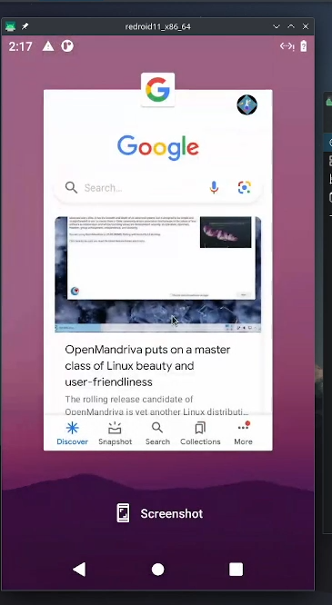

# android-docker-container

</code></pre></td><td class="lntd"><pre tabindex="0" class="chroma"><code class="language-bash" data-lang="bash">sudo pacman -S docker docker-compose
sudo systemctl enable --now docker
</code></pre></td></tr></tbody></button>

</code></pre></td><td class="lntd"><pre tabindex="0" class="chroma"><code class="language-bash" data-lang="bash">sudo pacman -S android-tools
sudo pacman -S scrcpy
</code></pre></td></tr></tbody><button class="copy-button" type="button" style="visibility: hidden; opacity: 0;"></table>

<code>## running redroid with custom settings (custom display for example)
docker run -itd --rm --privileged \
    --pull always \
    -v ~/data:/data \
    -p 5555:5555 \
    redroid/redroid:11.0.0-latest \
    androidboot.redroid_width=1080 \
    androidboot.redroid_height=1920 \
    androidboot.redroid_dpi=480 \
</code>

 
    
    

 
